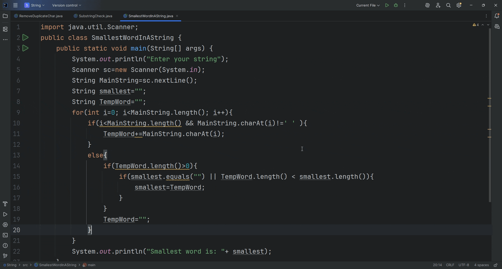

# SmallestWordInAString

## Description
`SmallestWordInAString` is a Java program that reads a string from the user and finds the **smallest word** within it. The program avoids using built-in methods like `.split()` and instead manually processes the string character by character to extract words.

## Features
- Takes user input for a sentence or string.
- Extracts words manually without using `.split()`.
- Finds and prints the smallest word in the given string.
- Works for any input string with multiple words separated by spaces.

## Usage
1. Clone the repository.
2. Compile the program:
   ```bash
   javac SmallestWordInAString.java
java SmallestWordInAString

### 🎥 Demo Output


